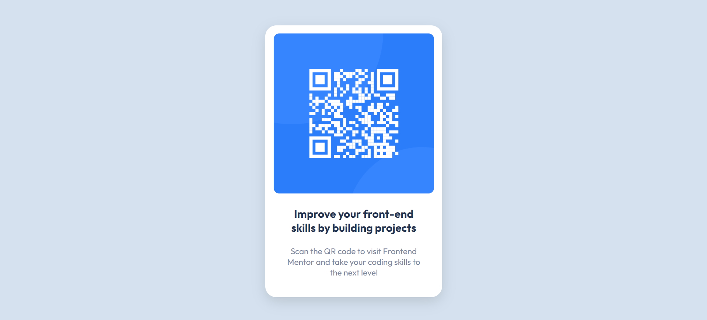

# Frontend Mentor - QR code component solution

This is a solution to the [QR code component challenge on Frontend Mentor](https://www.frontendmentor.io/challenges/qr-code-component-iux_sIO_H). Frontend Mentor challenges help you improve your coding skills by building realistic projects. 

## Table of contents

- [Overview](#overview)
  - [Screenshot](#screenshot)
  - [Links](#links)
- [My process](#my-process)
  - [Built with](#built-with)
  - [What I learned](#what-i-learned)
  - [Continued development](#continued-development)
- [Author](#author)

**Note: Delete this note and update the table of contents based on what sections you keep.**

## Overview

### Screenshot

### Links

- Solution URL: [Add solution URL here](https://github.com/KerwinAngeles/QR-Card)
- Live Site URL: [Add live site URL here](https://qr-card-ker.netlify.app/)

## My process

### Built with

- Semantic HTML5 markup
- CSS custom properties
- Flexbox

### What I learned
I learned how to use flexbox and how can I apply for every design that I make.

### Continued development

I'm going to continued development the semantic html and don't use div for all.
I'm going to continued development how to use the property shadow and how can I apply 
at the moment that I want to use.
I'm going to continued development how can I put the exact height and width to the viewport for every design that I make.
I'm going to continued development how can I use property ::root.

## Author

- Website - [Kerwin](https://www.your-site.com)
- Frontend Mentor - [@KerwinAngeles](https://www.frontendmentor.io/profile/KerwinAngeles)
